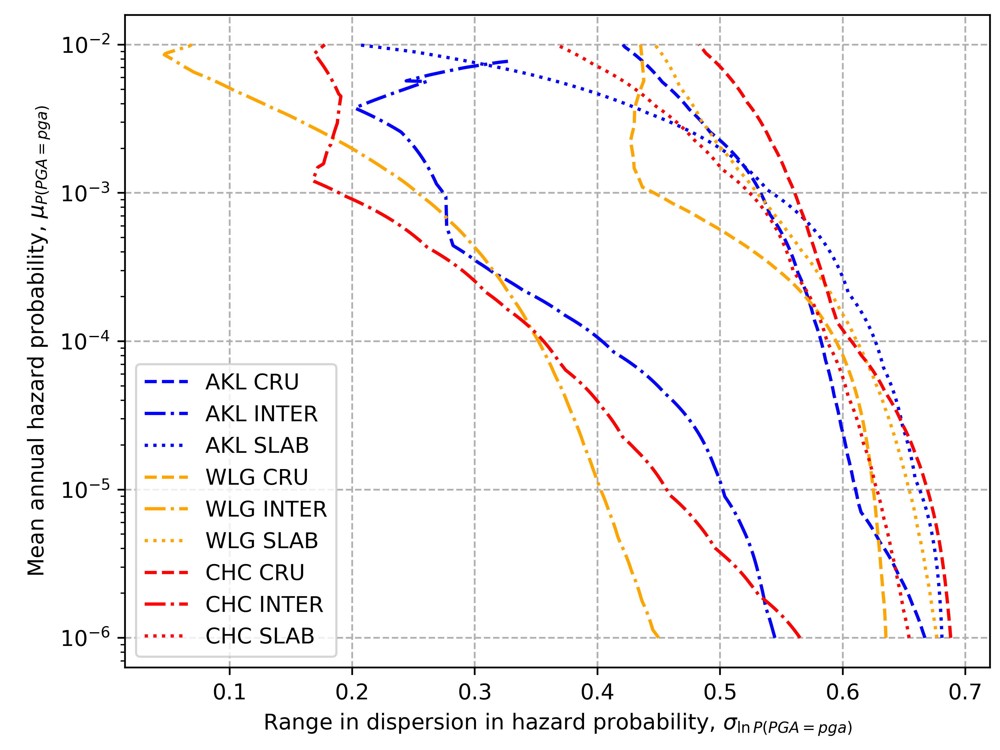

### Overview

This package has utilities for working with the logic tree used in [New Zealand's National Seismic Hazard Model 
(NSHM) 2022](https://www.gns.cri.nz/research-projects/national-seismic-hazard-model/). 
With this package, you can create modified logic trees and use them to calculate new hazard curves.

### Installation
1. Clone the repository. One way to do this is to open a terminal and run the following command: 
    
   1. `git clone git@github.com:ucgmsim/nshm_logic_tree_utilities.git`

2. Navigate to the repository directory and create a virtual environment. One way to do this is to run the following 
   commands in the terminal:

   1. `cd nshm_logic_tree_utilities`
   2. `python -m venv .venv`

3. Activate the new virtual environment by running the following command in the terminal:
   1. `source .venv/bin/activate`

4. Install the required packages by running the following command in the terminal (without changing directories):
   1. `pip install -e .`

### Usage

1. To modify the standard NZ NSHM 2022 logic tree and generate hazard curves:

   1. Go to the `nshm_logic_tree_utilities/scripts` directory (where this `nshm_logic_tree_utilities` directory is inside the first)
   2. Open `nshm_logic_tree_utilities/run_toshi_hazard_post_config.yaml`
   3. Modify the line containing `output_directory : "/home/arr65/data/nshm/output"` to use your directory
   4. Run the code with `python nshm_logic_tree_utilities/scripts/run_toshi_hazard_post_script.py`

2. To plot the results:
   1. Run `python nshm_logic_tree_utilities/scripts/plotting_script.py`

Note that the examples provided in `run_toshi_hazard_post_script.py` and `plotting_script.py`
can be modified for your purposes.

### Background

The 2022 revision of Aotearoa New Zealand’s National Seismic Hazard Model 
([NSHM 2022](https://www.gns.cri.nz/research-projects/national-seismic-hazard-model/)) is a significant improvement 
over the previous 2010 NSHM. NSHM 2022 uses a logic tree to better quantify modelling (epistemic) uncertainty.  

A logic tree consists of many branches that lead to different predictions reflecting epistemic uncertainty. 
A mean hazard model is produced by combining the individual branches based on their weight (degree of belief). 
The NSHM 2022 logic tree consists of approximately one million branches, making it challenging to intuitively understand 
which branches contribute the most to the hazard and uncertainty. However, this information could inform future research 
directions, making it highly valuable. Therefore, we systematically removed parts of the NSHM 2022 logic tree and 
re-computed the hazard curves.  

[GNS Science](https://github.com/GNS-Science) implemented the NSHM 2022 logic tree using pre-computed components that can 
be combined in different ways 
([DiCaprio et al. 2024](https://pubs.geoscienceworld.org/ssa/srl/article/95/1/125/628895/Calculation-of-National-Seismic-Hazard-Models-with)).
We downloaded approximately 500 GB of pre-computed components 
(private communication with Christopher J. DiCaprio), and utilized GNS Science’s open-source Python-based software to 
generate hazard curves from modified logic trees.

### Code purpose

With this code, we systematically isolated parts of the logic tree and examined the resulting hazard and epistemic 
uncertainty. We generated hazard curves for a range of intensity measures in the locations of Wellington, 
Christchurch, and Auckland, which have high, moderate, and low seismic hazard, respectively. 
We initially used a range of Vs30 values but as this had little effect, we adopted a constant Vs30 of 400 m/s for 
all locations. The NSHM 2022 logic tree consists of separate component logic trees for the source or seismicity rate 
models (SRM) and the ground motion characterization models (GMCMs). A schematic representation of the component logic 
trees for crustal tectonic region type is shown in Figure 1.

*Figure 1: The crustal seismicity rate model (SRM) logic tree (left) and the ground motion characterization
model (GMCM) logic tree (right). Each branch in the crustal SRM contains all lower branches (adapted
from [DiCaprio et al., 2024](https://pubs.geoscienceworld.org/ssa/srl/article/95/1/125/628895/Calculation-of-National-Seismic-Hazard-Models-with) 
and 
[Gerstenberger et al., 2024](https://pubs.geoscienceworld.org/ssa/bssa/article/114/1/7/631699))*.

We determined the epistemic uncertainty contributions of the component logic trees by reducing one to the single 
highest weighted branch and leaving the other in its entirety. With this approach, all epistemic uncertainty in 
the generated hazard curves originated from the component logic tree that was left in its entirety. To investigate 
individual models within the SRM or GMCM logic trees, we repeated this procedure with smaller component logic trees. 
To compare the epistemic uncertainty of several models, we followed 
[Bradley (2009)](https://journals.sagepub.com/doi/pdf/10.1193/1.3238556) and related the mean prediction to 
the dispersion in predictions for each intensity measure level, as demonstrated in Figure 2.

*Figure 2: Left: Hazard curves showing the upper, central, and lower branches of the Stafford (2022) crust model. 
Right: Epistemic uncertainty, showing references  to the corresponding points in  the hazard curves (left). This figure 
was created with the function `make_figure_showing_bradley2009_method` in `plotting_functions.py`*.

### Code output and results

The ground motion characterization models (GMCMs) contribute much more epistemic
uncertainty than the seismicity rate models (SRMs). Figure 3 shows the epistemic
uncertainty contributions for Wellington but other considered locations were similar. Future
research could most effectively reduce the epistemic uncertainty in the NSHM by focusing
on GMCMs.

*Figure 3: Modelling uncertainty in Wellington, shown by the coefficient of variation
(standard deviation /mean) of model predictions for annual probability of exceedance. This figure was created with the
function `make_figure_of_coefficient_of_variation` in `plotting_functions.py`*. 

The epistemic uncertainties for individual models are shown in Figure 4 a & b. We found that the
crustal [Stafford (2022)](https://nshm-static-reports.gns.cri.nz/NSHM/ScienceReports/SR2022-15%20NSHM%20Response%20Spectral%20Ordinates%20Model_FINAL.pdf) 
and 
[Atkinson (2022)](https://nshm-static-reports.gns.cri.nz/NSHM/ScienceReports/SR2022-11%20NSHM%20Backbone%20Ground-Motion%20Models_FINAL.pdf) 
GMCMs have higher epistemic uncertainties
than the other GMCMs. This is likely due to these models attempting to account for
epistemic uncertainty in a region-specific manner. For the SRM, the magnitude-frequency
distribution and moment rate scaling parameters for subduction interface sources produce
the highest epistemic uncertainty, consistent with [Gerstenberger, Bora, Bradley et al.
(2024)](https://pubs.geoscienceworld.org/ssa/bssa/article/114/1/7/631699). 
The next highest contribution is from the crustal moment rate scaling parameter.

*Figure 4a: Epistemic uncertainty contributions from individual models for Wellington (left) and
Christchurch (right). The rows show the crustal GMCMs (top), subduction interface and intraslab
GMCMs (middle), and SRM components (bottom). This figure was made with the function 
`make_figure_of_srm_and_gmcm_model_dispersions` in `plotting_functions.py`*. 

*Figure 4b: Epistemic uncertainty contributions from individual models for Wellington (left) and
Christchurch (middle), and Auckland (right). The rows show the crustal GMCMs (top), subduction interface and intraslab
GMCMs (middle), and SRM components (bottom). This figure was made with the function 
`make_figure_of_srm_and_gmcm_model_dispersions` in `plotting_functions.py`*.

Figures 5 and 6 are similar and show the epistemic uncertainty contributions of only seismicity rate model (SRM) 
components and only ground motion characterization models (GMCMs), respectively. They can be generated with functions
`plotting_functions.make_figure_of_srm_model_components` and `plotting_functions.make_figure_of_gmcm_model_components`,
respectively.

*Figure 5: Epistemic uncertainty contributions from seismicity rate model (SRM) components. This figure was generated
with the function `make_figure_of_srm_model_components` in `plotting_functions.py`*.

*Figure 6: Epistemic uncertainty contributions ground motion characterization models (GMCMs) components. 
This figure was generated with the function `make_figure_of_srm_model_components` in `plotting_functions.py`*.

Figure 7 shows the range of dispersions among ground motion characterization models (GMCMs) can be generated with
the function `plotting_functions.make_figure_of_gmcm_model_dispersions`.

*Figure 7: Epistemic uncertainty contributions ground motion characterization models (GMCMs) components. 
This figure was generated with the function `make_figure_of_srm_model_components` in `plotting_functions.py`*.

### Figures of individual hazard curve realizations

Every branch of the logic tree leads to an individual hazard curve realization. The function 
`plotting_functions.make_figures_of_individual_realizations_for_a_single_logic_tree` can be used to generate
figures of individual hazard curve realizations from a single logic tree configuration. Additionally, the function
`plotting_functions.make_figures_of_several_individual_realizations` can be used to generate figures of individual
hazard curve realizations from several logic tree configurations. Examples of the figures generated by these
functions are shown below.

### Individual hazard curves of seismicity rate models (SRM) components

### Individual hazard curves of crustal ground motion characterization models (GMCMs)

### Individual hazard curves of subduction interface & intraslab ground motion characterization models (GMCMs)

